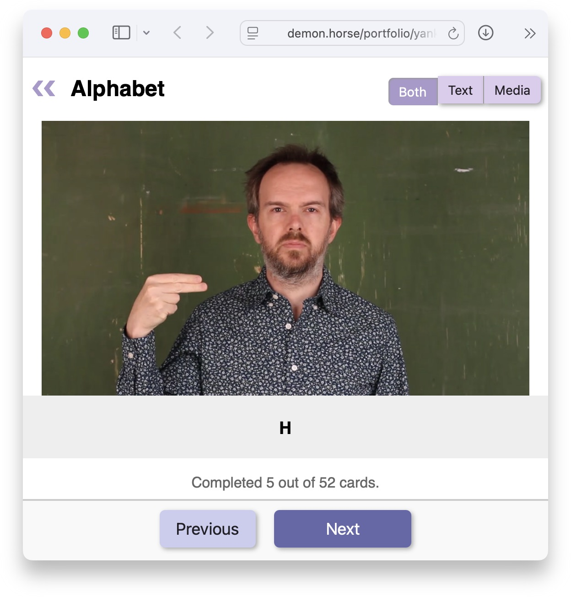

# Build flashcard decks from text files containing YouTube URLs

Yanki makes it easy to build and maintain video flashcard decks. It can export
decks to [Anki], or it can display flashcards in a simple web UI that can be
hosted on any web server.

Flashcards can use media from local video or image files, YouTube, or any other
source [yt-dlp] supports.

## Installation

There are a few prerequisites needed to use Yanki:

  * **`python`**: This may be built into your system, but I recommend using
    [`uvx`] run Yanki. `uvx` is part of [uv], which can be [installed][uv
    install] a number of ways, but it’s probably simplest to install `uv`
    through your package manager, e.g. [`brew install uv`] on macOS.
  * **`ffmpeg`**: On macOS, install it with [`brew install ffmpeg`] or from
    [ffmpeg.org]. On Linux or Windows, try installing it from a package manager
    or [yt-dlp’s ffmpeg].
  * **`deno` (only needed for YouTube downloads)**: On macOS, install it with
    [`brew install deno`] or from [deno.com]. On Linux or Windows, try
    installing it from a package manager or [deno.com].

## Quick start

Create a simple deck file, e.g. `basic.deck`, to define your flashcards:

```yaml
title: Basic ASL phrases
more: md:From [Lifeprint](https://www.lifeprint.com/)
audio: strip

https://www.youtube.com/watch?v=FHPszRvL9pg What is your name?
https://www.youtube.com/watch?v=zW8cpOVeKZ4 Are you deaf?
https://www.youtube.com/watch?v=xqKENRGkOUQ Are you a student?
```

### Web flashcard UI

You can try a demo of the web UI at <http://demon.horse/portfolio/yanki/ui/>.



To open your flashcard decks in the web UI:

    uvx yanki serve-flashcards --open *.deck

The `--open` flag will open your web browser to the correct URL on macOS and
some Linux distributions (requires [xdg-utils]). If that doesn’t work, you can
just open http://localhost:8000/ in your web browser.

You can also save the web UI into a directory and serve it from any web browser:

    uvx yanki save-flashcards my-export-dir *.deck

### Anki export

On macOS and some Linux distributions, you can make `yanki` open Anki and start
the import of the new deck:

    uvx yanki -v update basic.deck

Otherwise, you can make it build an `.apkg` and then import that into Anki:

    uvx yanki -v build -o basic.apkg basic.deck

## Deck file format

There is a reference for the deck file format in [REFERENCE.adoc][].

### Examples

The [`asl/`][asl] directory contains example `.deck` files that can be used to
build a deck for the vocabulary and phrases in each [Lifeprint.com ASLU][LP]
lesson. Its [README.md][asl] briefly explains how the signs were chosen.

> [!TIP]
> If you are interested in learning American Sign Language, please see Dr. Bill
Vicar’s [Lifeprint.com ASLU][LP]. These decks can help you, but they cannot
replace the Lifeprint lessons and vocabulary pages.
>
> Plus, Lifeprint is full of Dr. Bill’s humor.

## Command usage

This is a Python package that can be run with [`uvx`]. The most common usage is
probably just to build your decks and import them to Anki. That’s as simple as:

    uvx yanki update *.deck

You can see all the commands and options with `--help`:

```
❯ uvx yanki --help
Usage: yanki [OPTIONS] COMMAND [ARGS]...

  Build flashcard decks from text files containing YouTube URLs.

  There are two ways to use flashcards built with Yanki:

      1. With Anki <https://apps.ankiweb.net>. Use either `yanki update` to
      export decks directly to Anki, or `yanki build` to build an .apkg
      file that can be imported into Anki.

      2. Through a web UI. Use `yanki serve-flashcards` to start a web server
      you can visit at <http://localhost:8000/>, or save HTML into a
      directory with `yanki save-flashcards`.

Options:
  -v, --verbose                 Be more verbose. May be passed up to 3 times.
  --cache DIRECTORY             Path to cache for downloads and media files.
                                [default: $YANKI_CACHE or ~/.cache/yanki]
  --reprocess / --no-reprocess  Force reprocessing videos.
  -j, --concurrency INTEGER     Number of ffmpeg process to run at once.
                                [default: $YANKI_CONCURRENCY or 4]
  --version                     Show the version and exit.
  --help                        Show this message and exit.

Commands:
  build             Build an Anki package from deck files.
  list-notes        List notes in deck files.
  open-videos       Download, process, and open video URLs.
  save-flashcards   Save HTML flashcard UI to a directory.
  save-summary      Save HTML summary of decks to a directory.
  serve-flashcards  Serve HTML flashcards localhost:8000.
  serve-summary     Serve HTML summary of deck on localhost:8000.
  to-json           Generate JSON version of decks.
  update            Update Anki from deck files.
```

## License

Unless otherwise noted, this is dual-licensed under the Apache 2 and MIT
licenses. You may choose to use either.

  * [Apache License, Version 2.0](LICENSE-APACHE)
  * [MIT license](LICENSE-MIT)

<!-- GitHub only -->
Files in the `asl` directory are not licensed for redistribution. Copyright is
somewhat unclear, and at least some of the material is owned by [Dr. William
Vicars][LP].
<!-- /GitHub only -->

[Anki]: https://apps.ankiweb.net
[yt-dlp]: https://github.com/yt-dlp/yt-dlp
[ffmpeg.org]: https://www.ffmpeg.org
[`brew install ffmpeg`]: https://formulae.brew.sh/formula/ffmpeg#default
[`brew install deno`]: https://formulae.brew.sh/formula/deno#default
[deno.com]: https://docs.deno.com/runtime/getting_started/installation/
[`brew install uv`]: https://formulae.brew.sh/formula/uv#default
[yt-dlp’s ffmpeg]: https://github.com/yt-dlp/FFmpeg-Builds?tab=readme-ov-file#ffmpeg-static-auto-builds
[uv]: https://docs.astral.sh/uv/
[`uvx`]: https://docs.astral.sh/uv/guides/tools/#running-tools
[uv install]: https://docs.astral.sh/uv/getting-started/installation/
[xdg-utils]: https://www.freedesktop.org/wiki/Software/xdg-utils/
[REFERENCE.adoc]: REFERENCE.adoc
[asl]: asl#readme
[LP]: https://www.lifeprint.com
